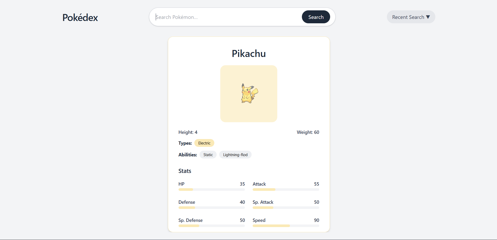

# Pokédex Search App 🎮🔍

_FinFactor — Software Engineer (Java) Assignment_

A modern Pokédex application built with **React + TailwindCSS** for the frontend and **Java Spring Boot** for the backend.

Users can search for Pokémon, view detailed stats in bar charts, see types/abilities, and enjoy autocomplete suggestions and local history tracking — all powered by PokeAPI with backend caching for fast performance.

---

## ⭐ Screenshot

---

## 🚀 Tech Stack

### 🖥️ Frontend

- React.js (Vite)
- TailwindCSS
- ReCharts (Bar Charts for stats visualization)

### ⚙ Backend

- Java (17+)
- Spring Boot
- REST API
- In-Memory Caching (performance optimization)

---

## ✨ Features

| Feature            | Description                                 |
| ------------------ | ------------------------------------------- |
| 🔎 Pokémon Search  | Fetch & display Pokémon details             |
| 📊 Stats Bar Chart | Visual representation of Pokémon stats      |
| 🧠 Autocomplete    | Smart suggestions when typing Pokémon names |
| 🕘 Recent Searches | Stores user’s last 5 searches locally       |
| ⏩ Backend Cache   | Faster repeated lookups                     |
| 🎨 Modern UI       | Clean, responsive design with Tailwind      |
| 💥 Skeleton Loader | Smooth UI while fetching API data           |
| ❌ Error Handling  | Friendly messaging for invalid search       |

---

## 📂 Project Structure

/
├── backend/ # Spring Boot REST API
│ ├── src/main/java/com/example/pokemon
│ ├── pom.xml
│ └── application.properties
│
└── frontend/ # React + Tailwind App
├── src/
├── package.json
└── tailwind.config.js

## Run Backend (Spring Boot)

### Requirements: Java 17 + Maven

- cd backend
- mvn spring-boot:run

## Run Frontend (React + Tailwind)

### Requirements: Node.js 16+

- cd ../frontend
- npm install
- npm run dev
